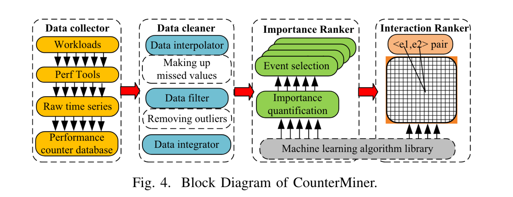
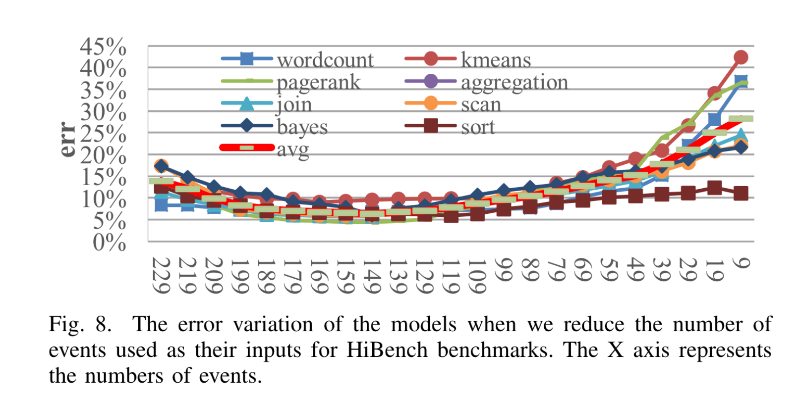
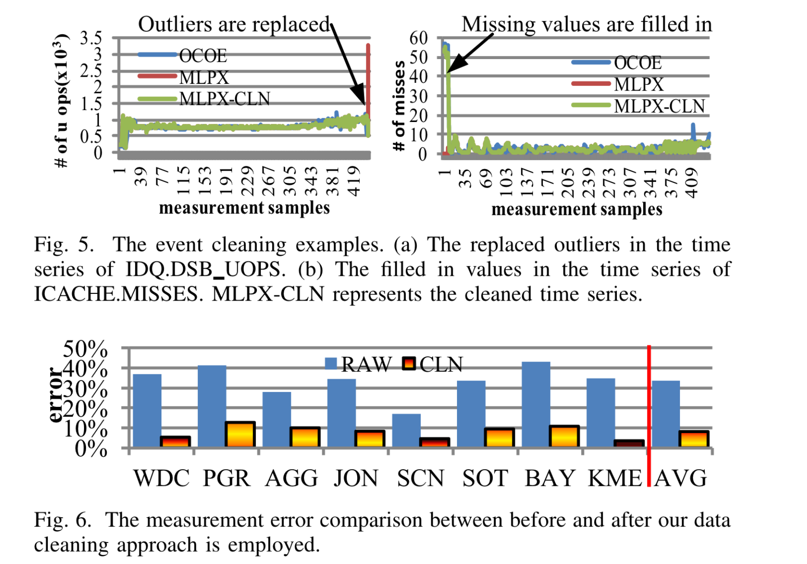
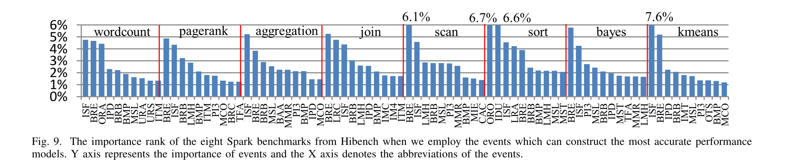
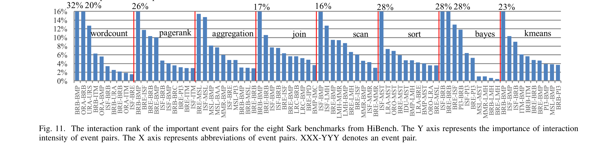

Lv, Yirong, et al. "**Counterminer: Mining big performance data from hardware counters.**" *2018 51st Annual IEEE/ACM International Symposium on Microarchitecture (MICRO)*. IEEE, 2018.

---

## Summary

This paper 1) using data cleaning techniques to reduce the measure errors of multiplexing hardware counters. 2) training a model to identify the importance of events.

## CounterMiner

**Data Collector** 

- using perf to collect OCOE and MLPX data, transform them into time-series format and store them on a database.

**Data Cleaner** 

- using data of OCOE as referenece, 1) replacing the **outliers** with reasonable value. 2) Making up missing value, KNN for non-zero values.

**Importance Ranker**

- Using Stochastic Gradient Boosted Regression Tress (**SG-BRT**) algorithm to train a model whose input events, output is IPC. 

	* why using this algorithm ?
		* > The key insight is that SGBRT combines a number of tree models in a stagewise manner, where each one reflects a part of the performance

- Using this model to rank the importance of every event. Iteratively removing the 10 least important event and training the model with remain events until obtain the **Most Accuracte Performance Model** for a program. 

**Interaction Ranker**

- construct a linear regression model for each pair of event to identify the interaction of  them.

## Experiments

**Benchmarks**: CloudSuite 3.0 and 8 program from HiBench with Spack 2.0.

**Data cleaning**

{: style="zoom:40%"}

**Importance Rank**

- ISF: ILD_STALL.IQ_FULL. Stall cycles due to IQ is full.
- BRE: BR_INST EXEC.ALL_BRANCHES. Counts all near executed branches (not necessarily retired).
- BRB: BR_INST_RETIRED.ALL_BRANCHES. Counts the number of retired branch instructions.

**Important Event Interactions**

