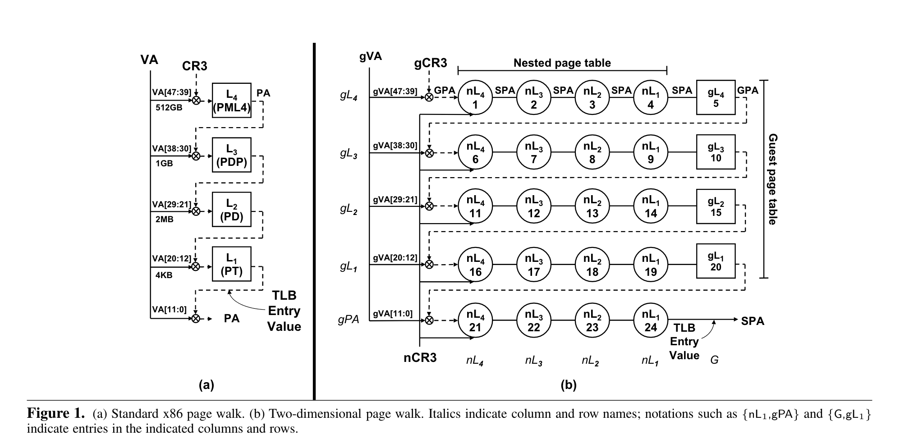
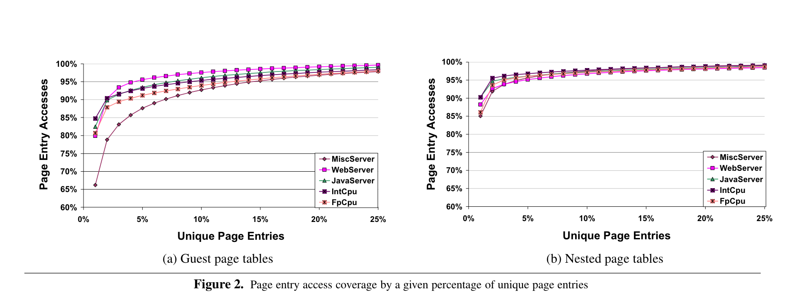
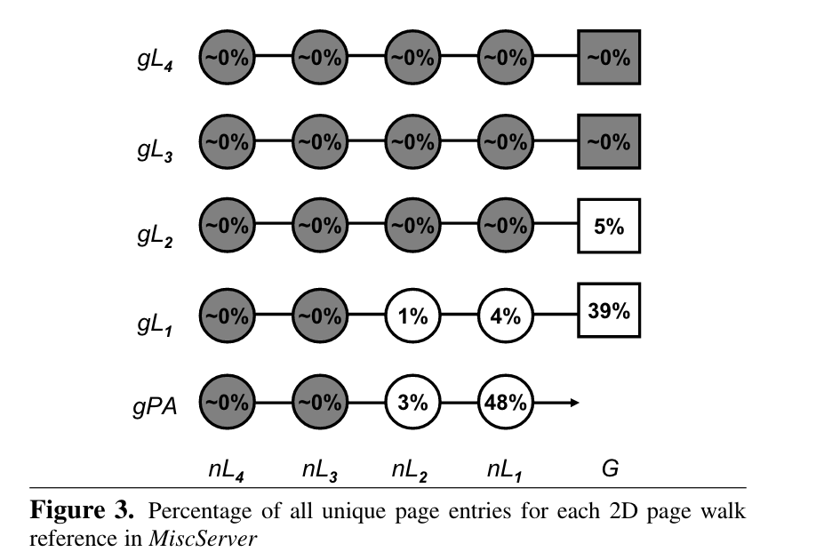
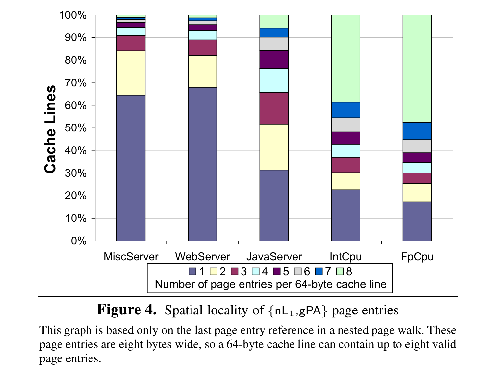
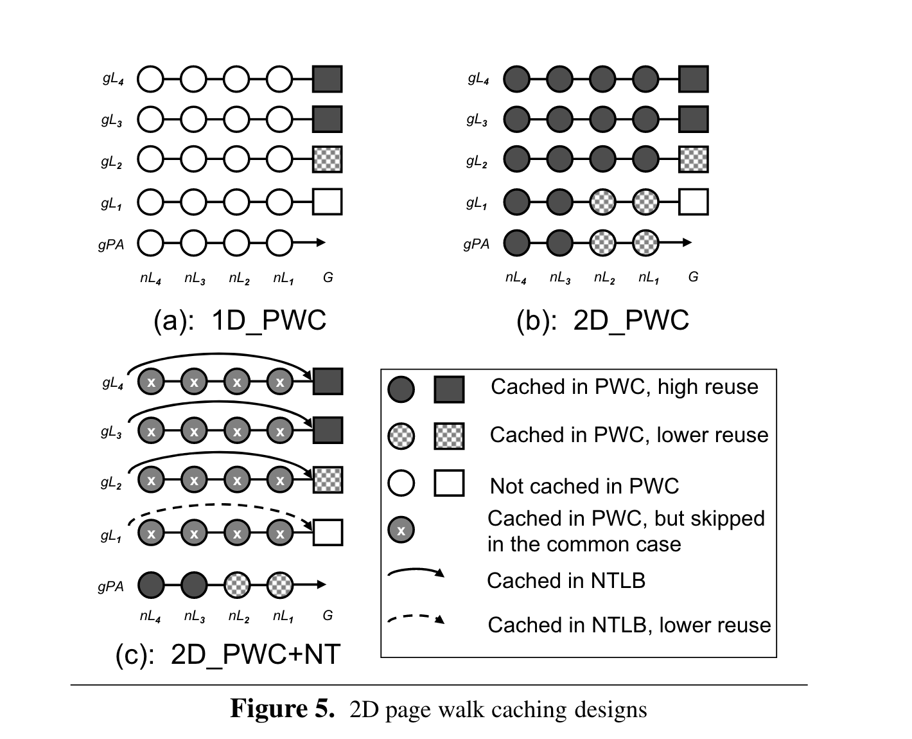
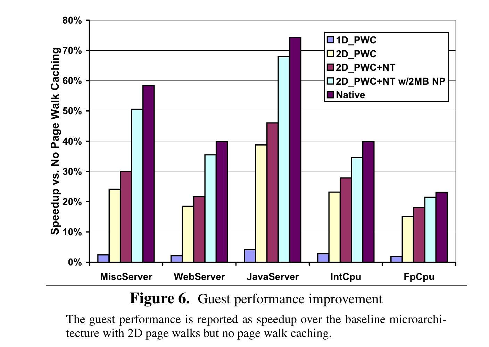
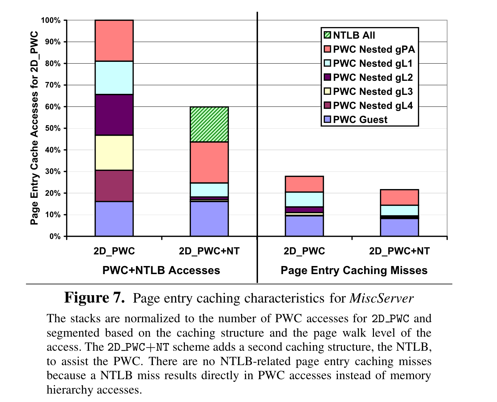

Bhargava, Ravi, et al. **"Accelerating two-dimensional page walks for virtualized systems."** *Proceedings of the 13th international conference on Architectural support for programming languages and operating systems*. 2008.

---

## Summary

This paper identifies high page entry reuse during two-dimensional page walk in virtualized systems, designed a new caching structure to accelerate memory access.

---

[Notes](https://pages.cs.wisc.edu/~remzi/Classes/838/Spring2013/Notes/twodimwalk.pdf) from remzi CS838 virtualization Spring 2013 gives some question and corresponding answers to help understanding this paper.

## Two-Dimensional Page Walk

### Figure 1. (a)

cr3 stores the 4KB-aligned physical address of first level page table. Using *VA[47:39]* as index of first page table gives a physical address (cr3[*VA[47:39]*]) where stores the physical address of next level page table.

### Figure 1. (b)

gCR3 stores the **guest** physical address of first level page table. Using *VA[47:39]* as index of first page table gives a guest physical address  **which requires translation by nested page table to give a system physical address** where stores the  guest physical address of next level (guest) page table.

**TLB: (Guest) Virtual Address to (System) Physical Address mapping.**

## Page Walk Characterization

**page entry reuse**

- for native system, using less than 10% unique page entries to cover more than 90% page entry access. Higher reuse in virtualized system.

	 

**unique page entry distribution**

-  most unique page entry exists at {gPA, nL1} and {gL1, G}. More unique page entry results worse caching performance.
-  one gL4 entry covers 512 GB virtual memory.

	 {: style="zoom:50%"}

**Spatial locality**

- fixme: understand the this figure

{: style="zoom:35%"}

## Page Walk Cache Design

**Page Wack Cache (PWC)**

> - PWC is a small, full-associative, physically-taged **page entry cache**. 
> - The PWC stores page entries from all page table levels except L1, which is effectively stored in the TLB.

- PWC is used for accelerating the page walk when TLB miss.
- PWC dosen't store the L1 page table entry, because normal TLB stores the mapping of  virtual page number to physical page number, physical page number is exact the L1 page table entry. 

### Three cache design

{: style="zoom:40%"}

One-Dimensional Page Walk Cache (**1D_PWC**)

- only caching guest dimension, namely only {G, gL4}, {G, gL3}, {G, gL2}. Note that {G,gL1} is not cached for the same reason, normal TLB stores the value of {G, gL1}.

Two-Dimensional Page Walk Cache (**2D_PWC**)

- all page entries are cache. All page entries are tagged with their **system physical address**.
- fixme: how are {nL4, gL4},  {nL4, gL3},  {nL4, gL2},  {nL4, gL1},  {nL4, gPA} cached in PWC when all page entries are tagged with system physical address.

Two-Dimensional Page Walk Cache + Nested TLB (**2D_PWC+NT**)

- Nested TLB: map guest physical address to system physical address, more specificly use the guest physical address of guest page entry to cache the corresponding nL1 entry.

- Not cache the gPA level.

	

## Results

#### Guest Performance Improvement

{: style="zoom:40%"}

#### Nested TLB

{: style="zoom:40%"}

nested TLB elimates most PWC Nested gL2, gL3, gL4 access.